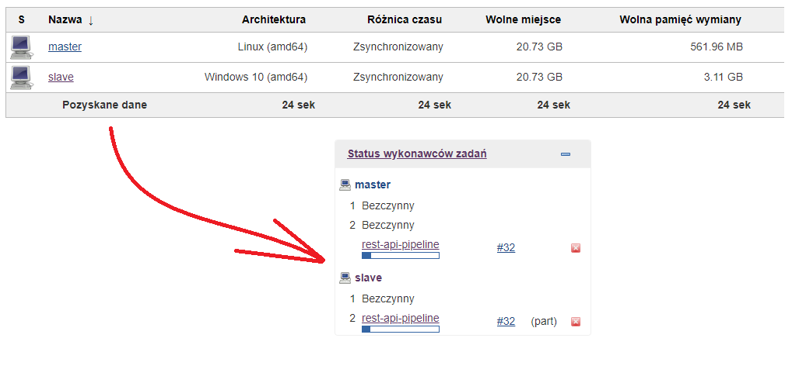

# Jenkins-2-SL - Exercise 03 - Nodes, Parallel Stage and Manual Approval

### Intro
This exercise shows
* how to `run` some tasks `on different nodes`
* how to do `parallel execution`
* * `stash`/`unstash` changes
* how to use `manual stage`

### Prerequisites
* same as in Exercise 02

### Installation
* configure maven version `maven-3.6.1` under Jenkins Management -> Global Tools
* define `slave` node under Jenkins Management -> Nodes Management -> new Node
* * Example :: use **Launch agent via java Web Start** + `java -jar agent.jar -jnlpUrl HOST -secret SECRET -workDir DIR`

* create job `Pipeline` type using `rest-api-pipeline.groovy` script
